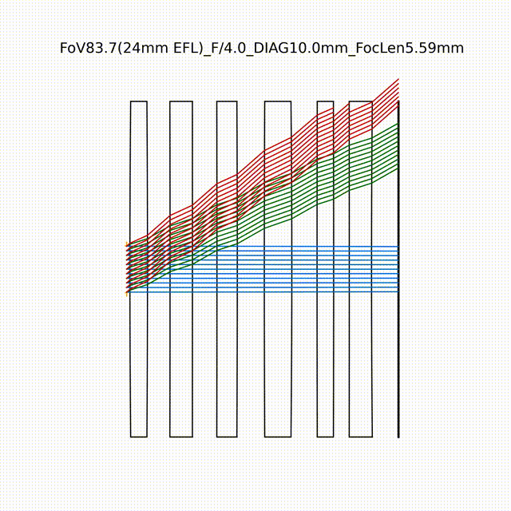
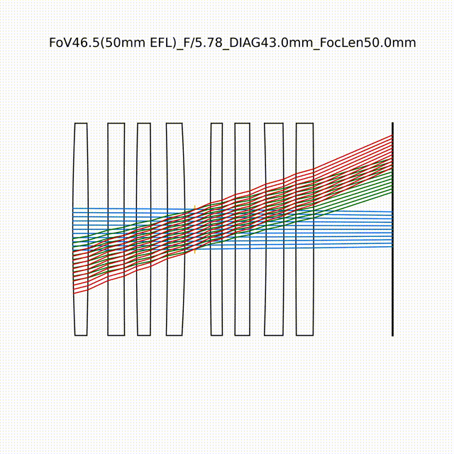
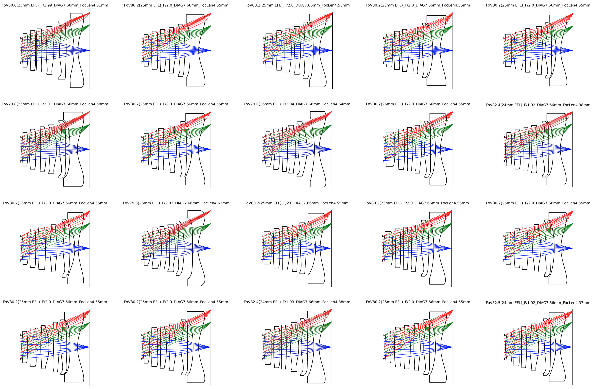
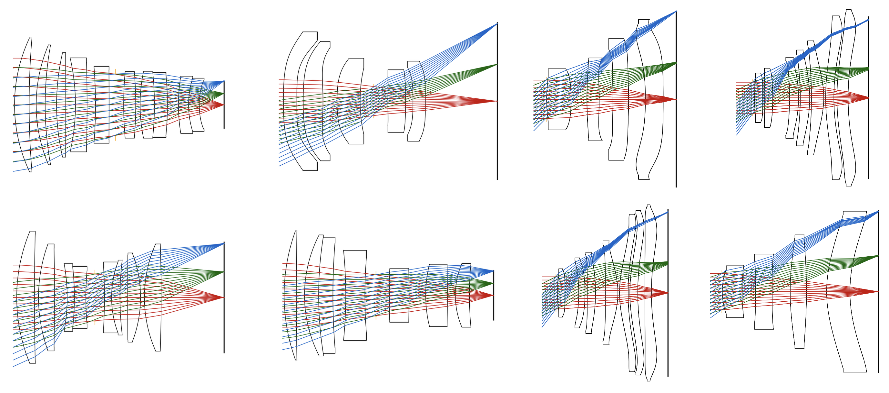

# AutoLens

**AI-powered automated optical lens design using differentiable optimization and deep learning**

AutoLens is an automated lens design project that uses gradient backpropagation and curriculum learning to optimize optical systems from scratch. Built on top of the [DeepLens](https://github.com/singer-yang/DeepLens) differentiable optics framework, AutoLens delivers optimization capabilities that go far beyond what commercial lens design software can offer.

## Key Features

- End-to-end differentiable ray tracing with PyTorch
- Curriculum learning for ab initio (from-scratch) lens design
- Wide-angle, full-frame, and cellphone lens optimization
- Aspherical and spherical surface support
- GPU-accelerated via CUDA
- Compatible with the [DeepLens](https://github.com/singer-yang/DeepLens) framework

## Getting Started

```bash
# Clone the repository
git clone https://github.com/singer-yang/AutoLens.git
cd AutoLens

# Create and activate the conda environment
conda env create -f environment.yml
conda activate autolens

# Run the automated lens design script
python 1_autolens.py

# (Optional) Refine an existing lens design
python 2_lens_optim.py
```

## Lens Design Examples

### Example 1: Wide-Angle Lens

- Field of View: 80°
- F-number: F/2.0
- Focal Length: 4.55 mm



### Example 2: Full-Frame Lens

- Field of View: Full-frame (43.3 mm diagonal)
- F-number: F/2.0
- Focal Length: 50 mm



### Example 3: Multiple Designs from Random Seeds

20 randomized automated lens design results for FoV 80°, F/2.0, 4.55 mm focal length — demonstrating the diversity of solutions the optimizer can discover.



### Example 4: Ultra Design Targets

AutoLens supports challenging ultra-specification targets such as F/1.2 high-speed camera lenses and 120° wide-angle cellphone lenses. The figure below shows 8 diverse optimized designs across these demanding specifications.



## Project Structure

```
AutoLens/
├── 1_autolens.py        # Automated design from scratch (curriculum learning)
├── 2_lens_optim.py      # Refine an existing lens with Adam optimizer
├── 0_hello_deeplens.py  # Introductory example
├── configs/             # Lens configuration files
├── deeplens/            # Core ray-tracing engine (DeepLens submodule)
├── datasets/            # Example lens files
└── assets/              # Images, animations, and other static assets
```

## Citation

If you find this repository helpful, please cite our paper:

```bibtex
@article{yang2024curriculum,
  title={Curriculum learning for ab initio deep learned refractive optics},
  author={Yang, Xinge and Fu, Qiang and Heidrich, Wolfgang},
  journal={Nature Communications},
  year={2024},
  publisher={Nature Publishing Group}
}
```

## License

This project is licensed under the [Apache License 2.0](LICENSE).
